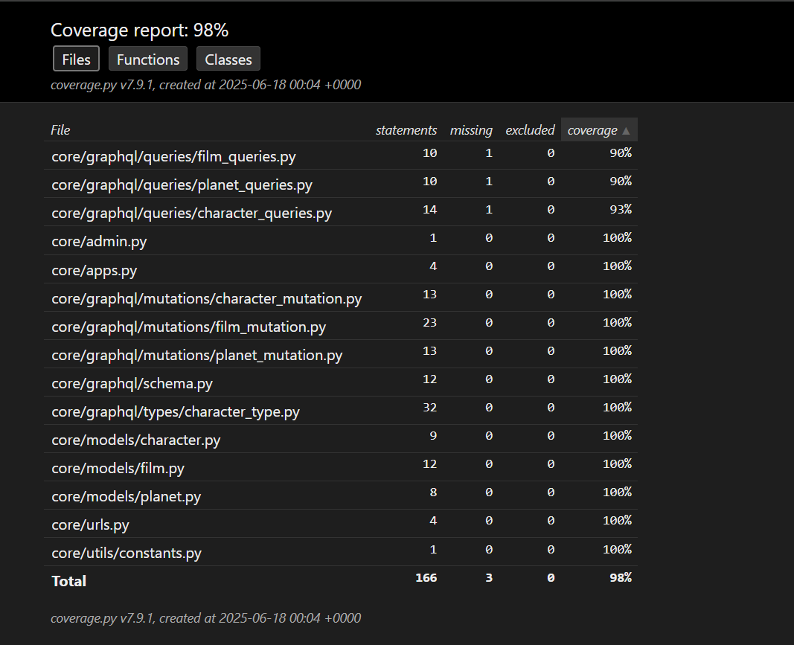
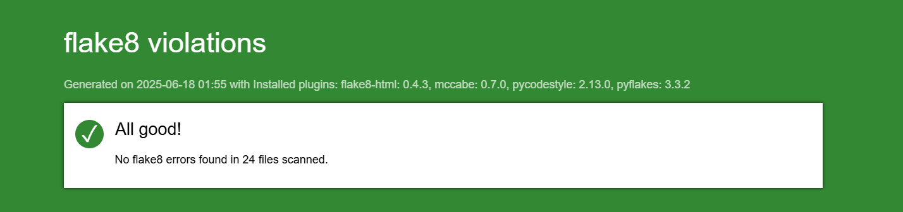

# Star Wars GraphQL API

Star Wars GraphQL API

[](https://github.com/cookiecutter/cookiecutter-django/)
[](https://github.com/astral-sh/ruff)

License: MIT

## Settings

Moved to [settings](https://cookiecutter-django.readthedocs.io/en/latest/1-getting-started/settings.html).

## Github
### Clonar el repositorio

Puedes clonar este repositorio público utilizando cualquiera de los siguientes métodos:

#### Usando SSH

```bash
git clone git@github.com:IrvinAlexanders/starwars_api.git
```

#### Usando HTTPS

```bash
git clone https://github.com/IrvinAlexanders/starwars_api.git
```

#### Usando GitHub CLI

```bash
gh repo clone IrvinAlexanders/starwars_api
```

Sigue las instrucciones de tu método preferido para obtener una copia local del proyecto.

## Docker Usage

Este proyecto incluye archivos de configuración para Docker Compose que facilitan el despliegue en diferentes entornos:

### Entorno Local

Para levantar el entorno de desarrollo local:

```bash
docker compose -f docker-compose.local.yml up --build
```

### Documentación

Para generar y servir la documentación:

```bash
docker compose -f docker-compose.docs.yml up --build
```

La documentación estará disponible en [http://localhost:9000](http://localhost:7000) (ajusta el puerto si es necesario).

### Producción

Para desplegar en producción:

```bash
docker compose -f docker-compose.production.yml up --build -d
```

Asegúrate de configurar las variables de entorno necesarias antes de levantar los servicios en producción.

Consulta cada archivo `docker-compose.*.yml` para más detalles y personalizaciones.

## Basic Commands

### Configurar superusuario

Para crear una **cuenta de superusuario**, utiliza este comando:

    $ docker compose -f docker-compose.*.yml exec django python manage.py createsuperuser

Tienes que reemplazar `*` por el entorno ejecutado(local o production).

### Ejecutar pruebas unitarias ###
Para ejecutar las pruebas con coverage y ver el reporte en la terminal, usa los siguientes comandos (reemplaza `*` por el entorno correspondiente, por ejemplo, `local` o `production`):

```bash
docker compose -f docker-compose.*.yml exec django coverage run manage.py test
docker compose -f docker-compose.*.yml exec django coverage report
```

Si deseas ver un reporte más detallado o generar un archivo HTML:

```bash
docker compose -f docker-compose.*.yml exec django coverage html
```

Luego puedes descargar o revisar el archivo `htmlcov/index.html` generado.

### Llenar la base de datos con datos iniciales ###

```bash
docker compose -f docker-compose.local.yml exec django python manage.py seed_data
```

## Flujo de la Aplicación

A continuación se muestra el flujo principal de la aplicación Star Wars GraphQL API:


## Documentación GraphQL

Una vez que la aplicación está en funcionamiento, puedes acceder a la documentación interactiva de GraphQL proporcionada por Strawberry en la ruta `/graphql/`(Se ha documentado muy bien cada tipo, query y mutation para tener una buena documentación) en el puerto correspondiente. Ahí encontrarás detalles sobre los tipos, inputs y operaciones disponibles en la API.

Además, se ha generado documentación adicional utilizando Sphinx, enfocada en el código fuente y la arquitectura del proyecto. Esta documentación puede consultarse siguiendo las instrucciones de la sección de **Documentación** más arriba.

En base a la prueba, acá hay un query y mutaciones de utilidad:

### Consultar personaje y las péliculas en las que aparece
```graphql
query ListCharacters {
  characters(name: "") {
    edges {
      node {
        id
        name
        birthYear
        gender
        films {
          title
          openingCrawl
          episodeId
          director
          producers
          releaseDate
          planets {
            name
            climate
            population
          }
        }
      }
    }
  }
}
```
### Crear personaje
```graphql
mutation CreateCharacter {
  createCharacter(input: {
    name: "Leia Organa",
    birthYear: "19BBY",
    gender: "female"
  }) {
    id
    name
    birthYear
    gender
  }
}
```
### Crear Planeta
```graphql
mutation CreatePlanet {
  createPlanet(input: {
    name: "Tatooine",
    climate: "arid",
    population: 200000
  }) {
    id
    name
    climate
    population
  }
}
```
### Crear Película
```graphql
mutation CreateFilm {
  createFilm(input: {
    title: "A New Hope",
    openingCrawl: "It is a period of civil war...",
    director: "George Lucas",
    episodeId: 4,
    producers: "Gary Kurtz, Rick McCallum",
    releaseDate: "1977-05-25",
    characterIds: [1, 2],
    planetIds: [1]
  }) {
    id
    title
    director
    openingCrawl
    releaseDate
    planets {
      name
    }
  }
}
```
## Reportes de calidad en desarrollo

### Ejemplo de reportes HTML

A continuación se muestran ejemplos de los reportes generados durante el desarrollo:

#### Reporte de Coverage



#### Reporte de Flake8

