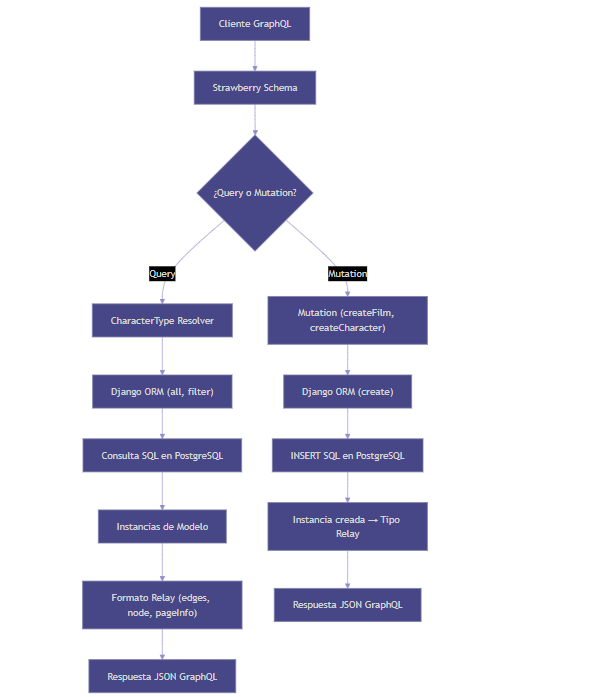

# Star Wars GraphQL API

Star Wars GraphQL API

[](https://github.com/cookiecutter/cookiecutter-django/)
[](https://github.com/astral-sh/ruff)

License: MIT

## Settings

Moved to [settings](https://cookiecutter-django.readthedocs.io/en/latest/1-getting-started/settings.html).

## Docker Usage

Este proyecto incluye archivos de configuración para Docker Compose que facilitan el despliegue en diferentes entornos:

### Entorno Local

Para levantar el entorno de desarrollo local:

```bash
docker compose -f docker-compose.local.yml up --build
```

### Documentación

Para generar y servir la documentación:

```bash
docker compose -f docker-compose.docs.yml up --build
```

La documentación estará disponible en [http://localhost:9000](http://localhost:7000) (ajusta el puerto si es necesario).

### Producción

Para desplegar en producción:

```bash
docker compose -f docker-compose.production.yml up --build -d
```

Asegúrate de configurar las variables de entorno necesarias antes de levantar los servicios en producción.

Consulta cada archivo `docker-compose.*.yml` para más detalles y personalizaciones.

## Basic Commands

### Configurar superusuario

Para crear una **cuenta de superusuario**, utiliza este comando:

    $ docker compose -f docker-compose.*.yml exec django python manage.py createsuperuser

Tienes que reemplazar `*` por el entorno ejecutado(local o production).

### Ejecutar pruebas unitarias ###
Para ejecutar las pruebas con coverage y ver el reporte en la terminal, usa los siguientes comandos (reemplaza `*` por el entorno correspondiente, por ejemplo, `local` o `production`):

```bash
docker compose -f docker-compose.*.yml exec django coverage run manage.py test
docker compose -f docker-compose.*.yml exec django coverage report
```

Si deseas ver un reporte más detallado o generar un archivo HTML:

```bash
docker compose -f docker-compose.*.yml exec django coverage html
```

Luego puedes descargar o revisar el archivo `htmlcov/index.html` generado.

## Flujo de la Aplicación

A continuación se muestra el flujo principal de la aplicación Star Wars GraphQL API:


